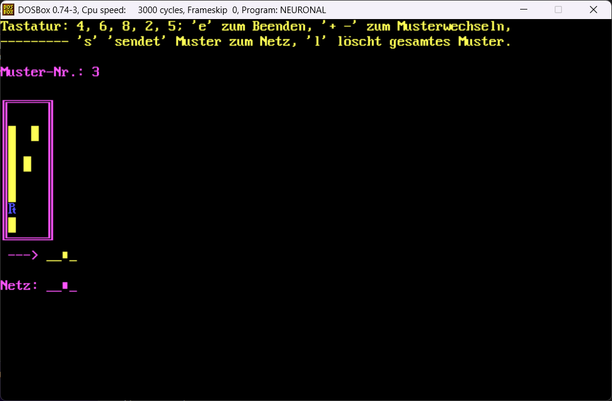
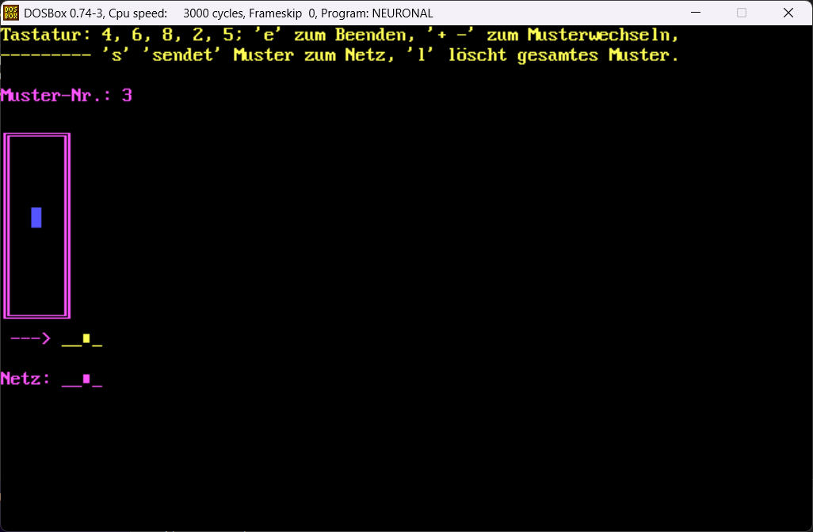

## A Simple Three-Layer Perceptron for MNIST-like Pattern Recognition in Modula-2

### Featuring an interactive pattern editor, backpropagation learning, and loss function visualization

This was developed in January 1994 using TopSpeed Modula-2 Version
1.17 for DOS (text mode and VGA graphics).

To run [the program](m2/NEURONAL.EXE), you can [download
DOSbox.](https://www.dosbox.com/download.php?main=1)

### Background

At that time, I was taking an introductory AI class at the University
of Hamburg (Prof. Peter Schefe, R.I.P.), and implemented this as a
demonstration of "MNIST"-like pattern recognition using a three-layer
perceptron with backpropagation learning for the AI lab class.

The three-layer perceptron and backpropagation learning algorithm was
described in pseudo-code in English in the well-known 1991 AI book
["Artificial Intelligence - Rich, E. and Knight, K, 2nd edition,
McGraw-Hill".](https://books.google.com/books/about/Artificial_Intelligence.html?id=6P6jPwAACAAJ)

### Program 

The workflow with this interactive program is as follows: 

1. Determine the topology of the three-layer perceptron, and other
   hyper-parameters such as the learning rate and the number of training
   epochs: 

   

2. Use the pattern editor to create the "training data", i.e., the "MNIST"-like one- or two-
   dimensional patterns that the perceptron shall learn recognize. Use the keypad number keys
   (`4`, `6`, `8`, `2`) for cursor movement, and the `5` to toggle a bit in the pattern.
   Use `+` and `-` to switch between patterns, or completely clear the current pattern
   with the `l` key: 

   

   

4. With the patterns (= training data) specified, start the backpropagation learning
   process by leaving the editor with the `e` key. The learning process starts, and
   the progress and convergence is visualized - the loss function for each pattern
   is shown graphically epoch by epoch. Usually, it converges quickly for each
   pattern; i.e., 100 epochs are typically more than enough with a learning rate of ~1. 
   The graphs require a VGA graphics card (DOSbox emulates it): 

   

6. With the three-layer perceptron fully trained, we can now use it for  inference.
   After training for the requested number of epochs, the program returns to the pattern editor.

   We can now recall the individual training patterns and send them to the
   perceptron with the `s` key; the editor then shows 
   the ground truth training label as well as the output computed by the
   network und `Netz:`. This simply shows the levels of the output perceptrons
   binarized via a > 0.5 threshold for `on` vs. `off`. Compare the `Netz:`
   classification result with the `--->` training label. If the net
   was trained successfully, it should match for each pattern (change patterns
   via `+` and `-` and repeatedly use `s`).
   
   Check the predefined patterns for correct classification, and also 
   modify them a bit (i.e., change them with with the editor and feed the
   modified patterns into the perceptron using the `s` key). 

   Sometimes, the perceptron learned to focus on a few characterstic
   "bits" in the training patterns; it is interesting to remove as many bits as
   possible from the patterns without changing the classification
   results. This "robustness" to noise and larges changes in the input pattern 
   without affecting classification was (and still is) a selling point 
   for perceptrons and/or neural networks, in general. 

   

   

   

   

### Source & Executable 

You can find a [DOS executable](m2/NEURONAL.EXE) as well as the
TopSpeed Modula-2 source code [here](m2/NEURONAL.MOD).

Enjoy! 

